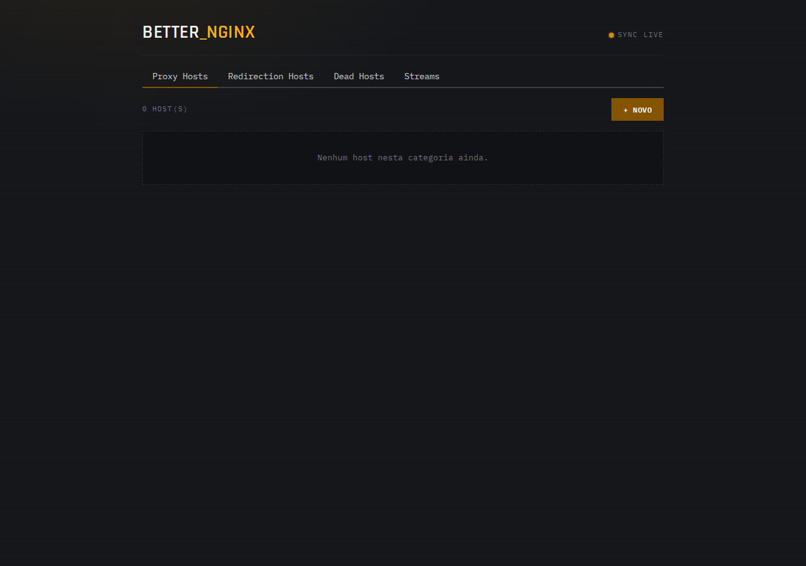
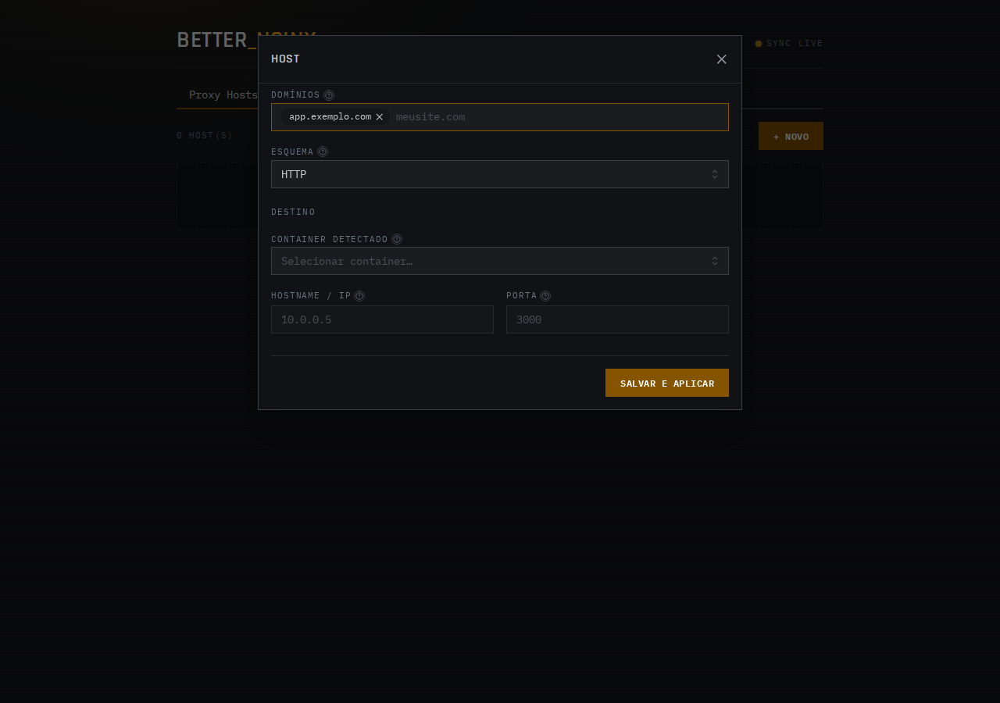
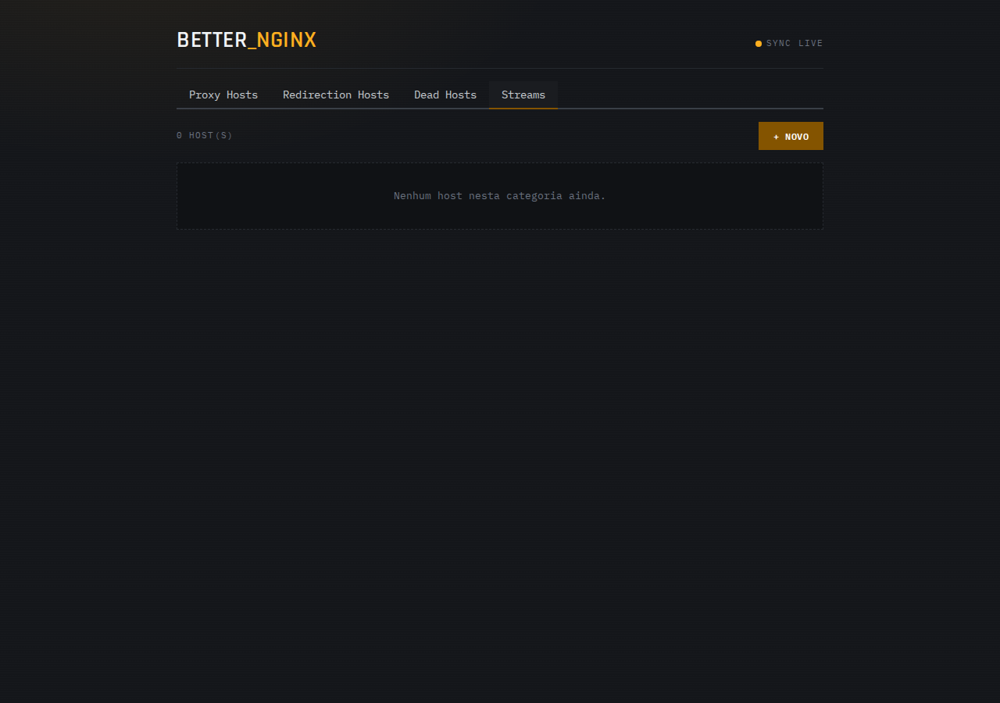

# better-nginx

GUI web para gerenciar server blocks do Nginx, com auto-descoberta de containers Docker via unix socket — o server block é gerado automaticamente a partir de labels no container, sem precisar editar arquivo de config na mão.

MVP: form estruturado (listen/server_name/root/locations), validação (`nginx -t`) e backup automático antes de aplicar, reload (`nginx -s reload`) só se a validação passar.

> [!IMPORTANT]
> Sem autenticação nesta versão. Não exponha a GUI (porta `3000`) publicamente — mantenha em rede interna/confiável.

## Screenshots

| Dashboard | Novo Proxy Host | Categorias |
|---|---|---|
|  |  |  |

## Requisitos

- Docker e Docker Compose
- Se for usar auto-discovery: containers alvo precisam estar na mesma rede Docker do `better-nginx`

## Setup

1. Clone o repositório e entre na pasta:
   ```bash
   git clone <repo>
   cd better-nginx
   ```
2. Copie o `docker-compose.yml` de exemplo (já incluso no repo) e ajuste conforme seu cenário — veja [Modos de operação](#modos-de-operação) abaixo.
3. Suba:
   ```bash
   docker compose up -d --build
   ```
4. Acesse a GUI em `http://localhost:3000`.

Ao subir, o `better-nginx`:
- Verifica se já existe config em `/etc/nginx/conf.d` (caso você tenha montado um volume com config existente) — se sim, mantém como está; se não, gera uma config padrão mínima e já sobe respondendo em `80/443`
- Escaneia containers com o label `better-nginx.enable=true` e gera os server blocks correspondentes automaticamente
- Continua escutando eventos do Docker (`start`/`die`) para manter os server blocks sincronizados em tempo real

## Modos de operação

No `docker-compose.yml`:

- **Borda (default):** publica `80:80` e `443:443` no host — o `better-nginx` é o proxy que recebe tráfego direto da internet/rede local
- **Upstream:** comente as linhas de `ports` referentes a 80/443 — o container só participa da rede Docker interna e recebe tráfego de outro proxy/load balancer na frente

## Auto-discovery via labels

Adicione estas labels no `docker-compose.yml` (ou `docker run --label`) do container que você quer expor:

```yaml
services:
  minha-app:
    image: minha-app:latest
    labels:
      better-nginx.enable: "true"
      better-nginx.host: "minhaapp.exemplo.com"
      better-nginx.port: "3000"       # porta interna que a app escuta
      better-nginx.location: "/"       # opcional, default "/"
    networks:
      - better-nginx-net              # precisa estar na mesma rede do better-nginx
```

O `proxy_pass` gerado aponta direto para o IP do container na rede Docker — não depende de portas publicadas no host.

## Config existente do Nginx

Se você já tem uma config de produção e quer que o `better-nginx` assuma o controle dela, monte o volume no `docker-compose.yml`:

```yaml
volumes:
  - /etc/nginx/conf.d:/etc/nginx/conf.d
```

Se o path montado já tiver arquivos `.conf`, o entrypoint mantém como está (não sobrescreve). Se vier vazio, gera uma config mínima padrão.

## Rodando localmente (dev, sem Docker)

Backend:
```bash
bun install
bun run dev
```

Frontend:
```bash
cd web
bun install
bun dev
```

O Vite (`web/`) faz proxy de `/api` para `http://localhost:3000` (configurado em `web/vite.config.ts`). Nesse modo o `better-nginx` precisa de um Nginx local instalado e acessível via `nginx -t`/`nginx -s reload`, e opcionalmente Docker rodando pra testar o auto-discovery.

## Segurança do socket Docker

O mount de `/var/run/docker.sock` equivale a acesso root no host. É montado como somente leitura (`:ro`) no `docker-compose.yml` de exemplo, mas ainda assim: mantenha o `better-nginx` em rede isolada e não exponha a GUI de administração publicamente.

## Fora do escopo (roadmap)

Autenticação, gestão remota via SSH, upstreams/load balancing avançado, gestão de certificados (certbot automático), multi-server, múltiplas redes Docker simultâneas.
